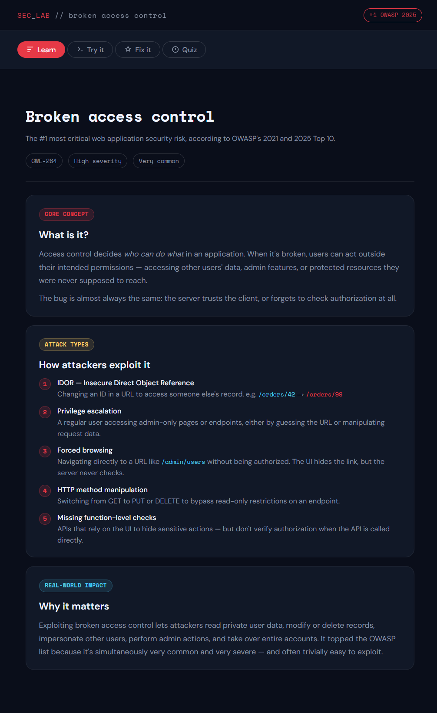
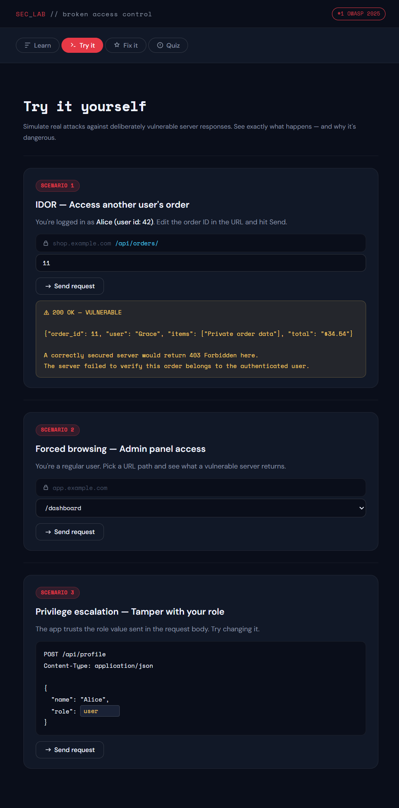
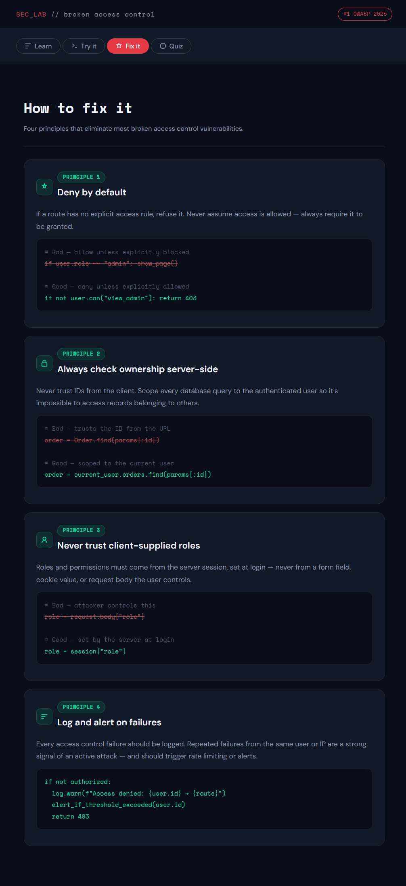
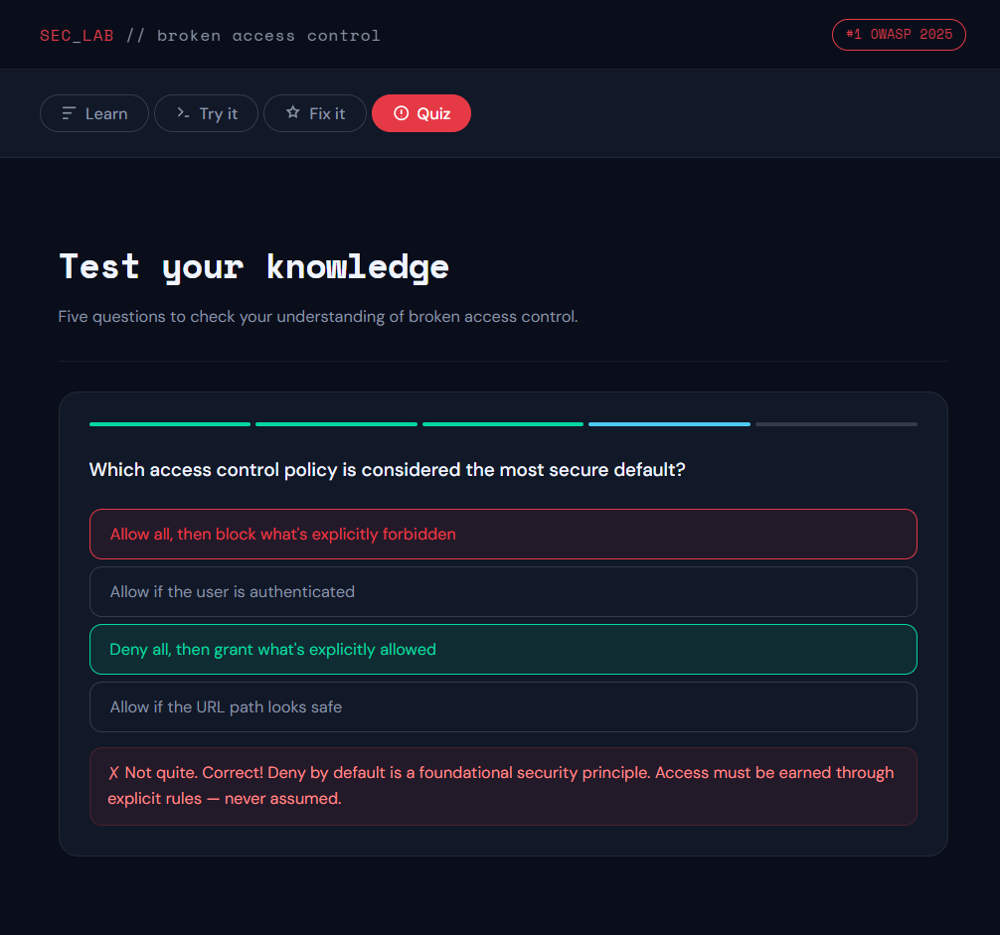

# Broken Access Control Educational App

## Overview
I used Claude to vibe code an educational tool/app to teach me what broken access control is. I chose Claude because I've heard good things about it from people I know.

## Description of the app
### Find the app here -> [Broken Access Control Demo App](../../code/broken-access-control-demo-app.html)

My prompt to claude was "I want to make an educational tool/app to help me learn what the broken access control security vulnerability is, since it was the top of the list in OWASP's Top 10 for 2025".

I decided to have claude make an educational tool to help me learn about this vulnerability because, for one, I really didn't know what broken access control was and wanted to learn, and two, I knew it would probably make an interactive app instead of just blocks of text to read, and it did! I learn a lot better by interacting rather than just reading, so the fact that it was able to generate something like this in just a few prompts was amazing.

## App breakdown

### The app contains four main sections:

First you learn about the vulnerability on the main landing page of the app:

Second, you can interact with the app to try out some ways access control can be broken:

Third, you learn principles and good practices to avoid these vulnerabilities:

And finally, there is a quiz at the end to see how well you learned everything:

## Lessons learned

When I first tried to vibe code an app like this, I tried to use Replit. I started with Replit because that was what was used for an example in class, and was one of Claude's recommendations for a vibe coding tool. I could not, however, get Replit to work. It kept giving me errors and wouldn't make anything, even when I gave it a simple prompt like, "make me a simple game".

What's funny is when I asked Claude to help me with Replit, it asked me what app I was trying to make. Rather than helping me with Replit, it just started making the app on it's own! I think I will use Claude for the remaining two vibe coding assignments because I was amazed with what it could do with just one prompt.

