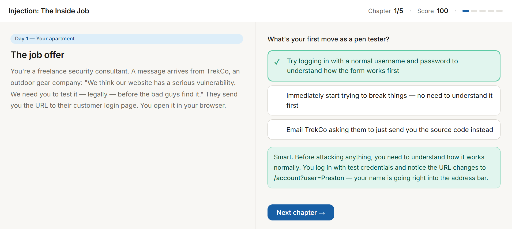
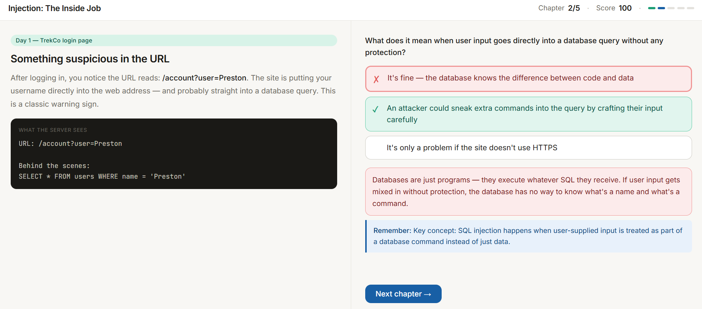
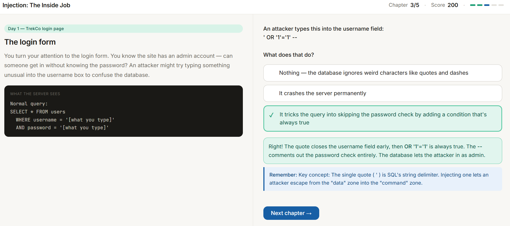
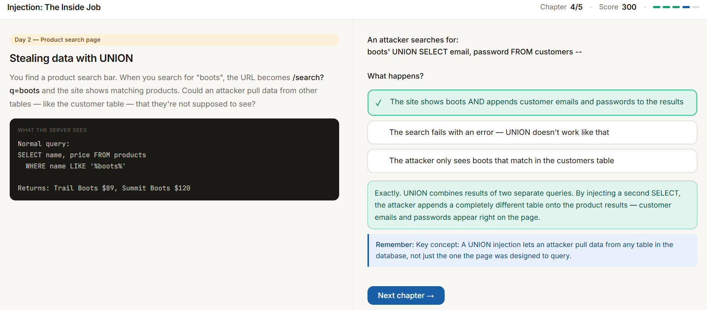
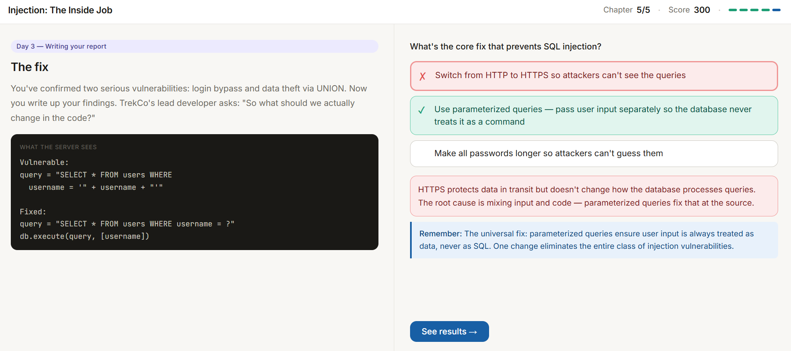

# Injection Educational Game

## Overview
I used Claude to vibe code an educational game to teach me more about injection. I chose Claude because that is what I used for the last vibe coding assignment, and it worked really well.

## Description of the game
### Find the game here -> [SQL Injection Game](../../code/injection_story_game.html)

My prompt was "I need to pick another OSWAP top 10 and vibe code an app to learn more about it. Let's make it an educational game. Out of these 9 topics, what would make the best learning game app?" I wanted to make the learning fun, and Claude suggested that injection would make a great learning game, so I went along with it.

The app is a (bit buggy) story based game where you are hired by a company to legally try and break into their system and find vulnerabilities. You are faced with 3 choices each scenario and have to choose the correct one. Even if you get it wrong or right, the game tells you the correct answer and why.

## Game breakdown

### Here are screenshots of all the parts of the story and the options you can take:

I like how this game visually shows you the injection both from the user's perspective and what happens in the code. It helped me a ton in learning what injection actually is. Injection is basically "injecting" code into an SQL query to get results that the programmer didn't intend for you to get. I like how the game helped me learn that to fix this vulnerability you just need to use parameterized queries.

## Lessons learned

My first prompt to Claude generated a game where you had to type in the SQL correctly to get the desired hacking result, but this was difficult for me since I don't have a ton of experience with SQL. This made me realize that there can be a lot of ambiguity with AI prompts, and you have to be very specific in your prompts to get what you want. It's interesting that AI will still try it's best, and I wonder if AI makes mistakes a lot of the time due to us not giving it a clear enough prompt. I like how with Claude it sometimes asks you follow-up questions before it starts generating a response.

