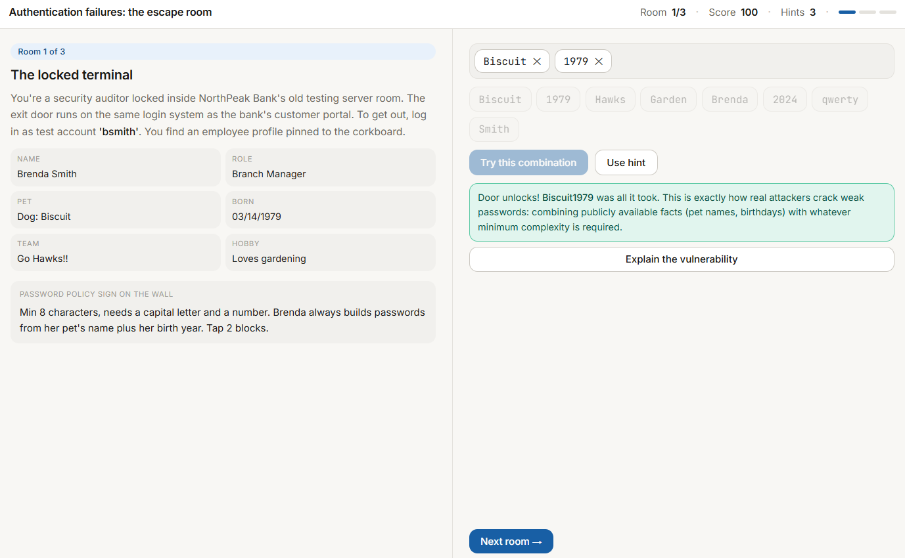
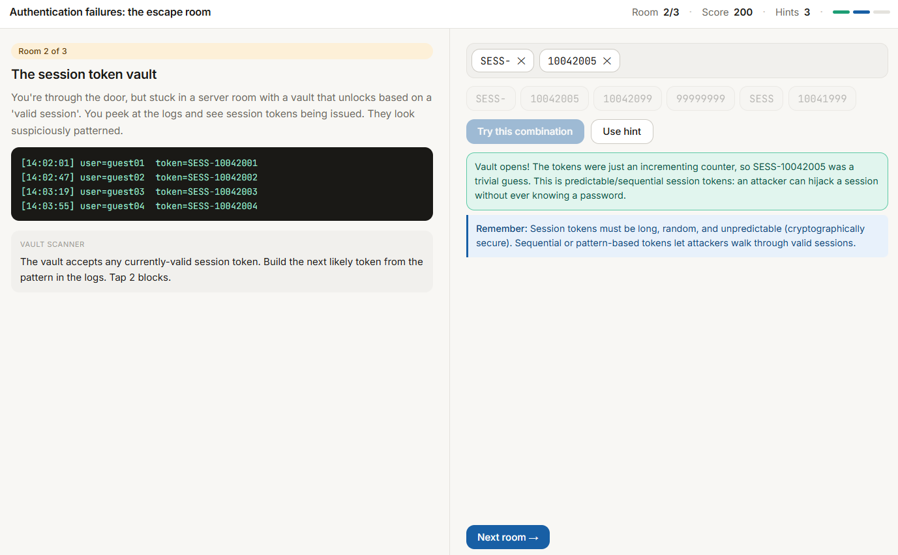
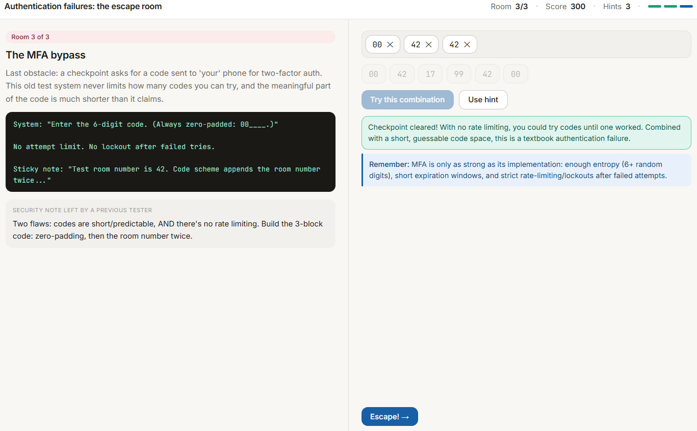

# Escape Game - Authentication Failure Examples

## Overview
I used Claude to vibe code an educational game to teach me more about authentication failures. Claude has worked well for the last two vibe coding assignments, so I decided to stick with it!

## Description of the game
### Find the game here -> [Auth Failure Escape Game](../../code/auth_escape_room.html)

My prompt was "I need to pick another OSWAP top 10 and vibe code an app to learn more about it. Can we do that game you suggested for Authentication Failures?" It had suggested a puzzle/escape room game for my previous assignment, I thought it would be fun to try it for this assignment.

The app is a puzzle / escape room type game where you have 3 different "rooms" you have to unlock or escape. The first room explains how weak password requirements make it easy for hackers to guess passwords just by combining identifying information about the user. It has you combine info from clues given to you to try and crack the password. The second room explains how session tokens with repeatable patterns are vulnerable to attacks, and you try to gain access to a valid session by guessing the session token patterns. The third room talks about weak MFA (multi factor authentication) where the codes aren't long enough and attempts to guess the code are unlimited, you then try and guess the code to escape the room.

## Game breakdown

### Here are screenshots of all 3 rooms you have to "escape":

## Lessons learned

I learned that guessing a weak password isn't that hard, and most people probably do the weakest password the system allows because that is the easiest for them to remember. Especially with identifying information about users being so easy to get ahold of now, it's important that systems require strong passwords to prevent authentication failures.
