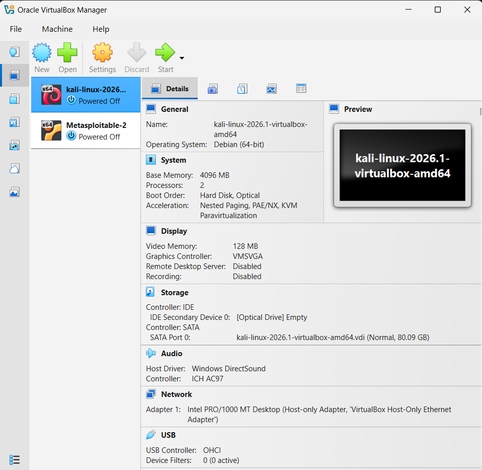
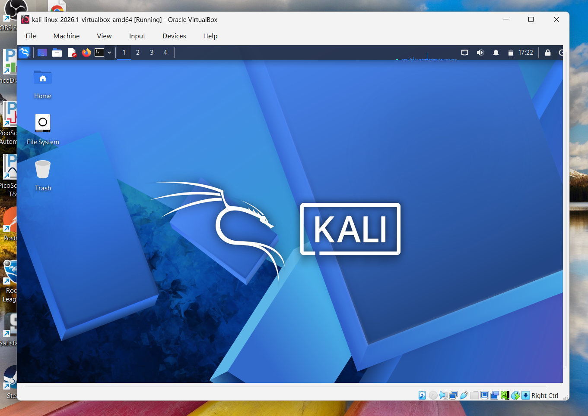
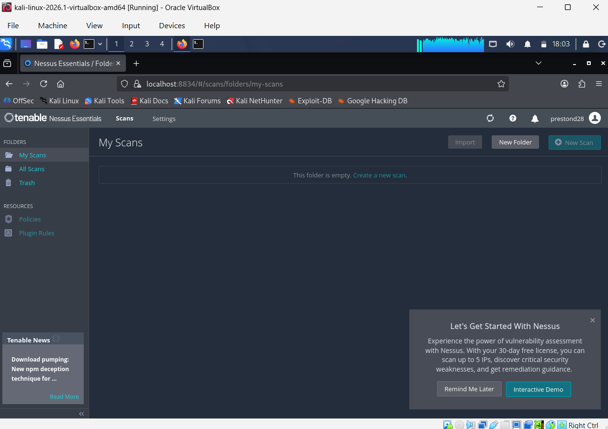
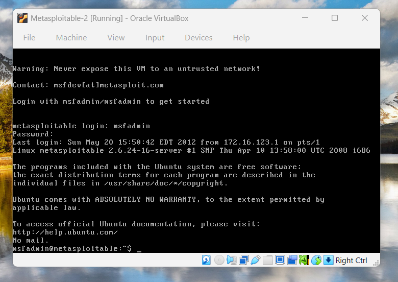
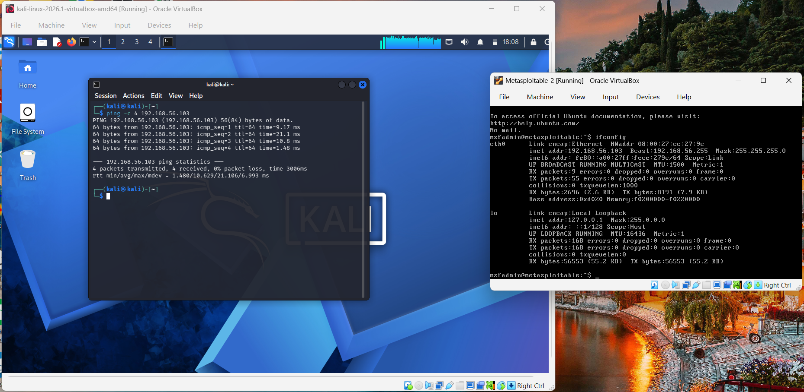

# Penetration Testing Lab Set Up with Kali Linux

## Overview
- Running on PC
- Virtual Box running two virtual machines: Kali Linux and Metasploitable 2

## Architectural Diagram

## Setting up Virtual Box

## Kali Linux Box Successfully Running

## Nessus Installed on Kali Linux

## Metasploitable 2 Box Successfully Running

## Kali Linux Box Pinging Metasploitable 2 Box

## Conclusion

Setting up this lab was harder than I originally thought it would be! I have never really worked with a virtual machine before, so a lot of the setup was completely new to me. Thankfully when I got stuck following the book, Claude (AI) was able to help me get unstuck and point me in the right direction. The hardest part was knowing how to get Nessus installed onto Kali Linux, because I didn't quite know how to download something and then transfer it to the VM. I eventually figured out that I needed to allow Kali Linux to connect to the internet by changing the virtualbox settings and navigate to the download page for Nessus directly in the virtual machine! Honestly there was some inception going on there that blew my mind, but hopefully I will get more familiar with virtual machines and setting them up as the course progresses.