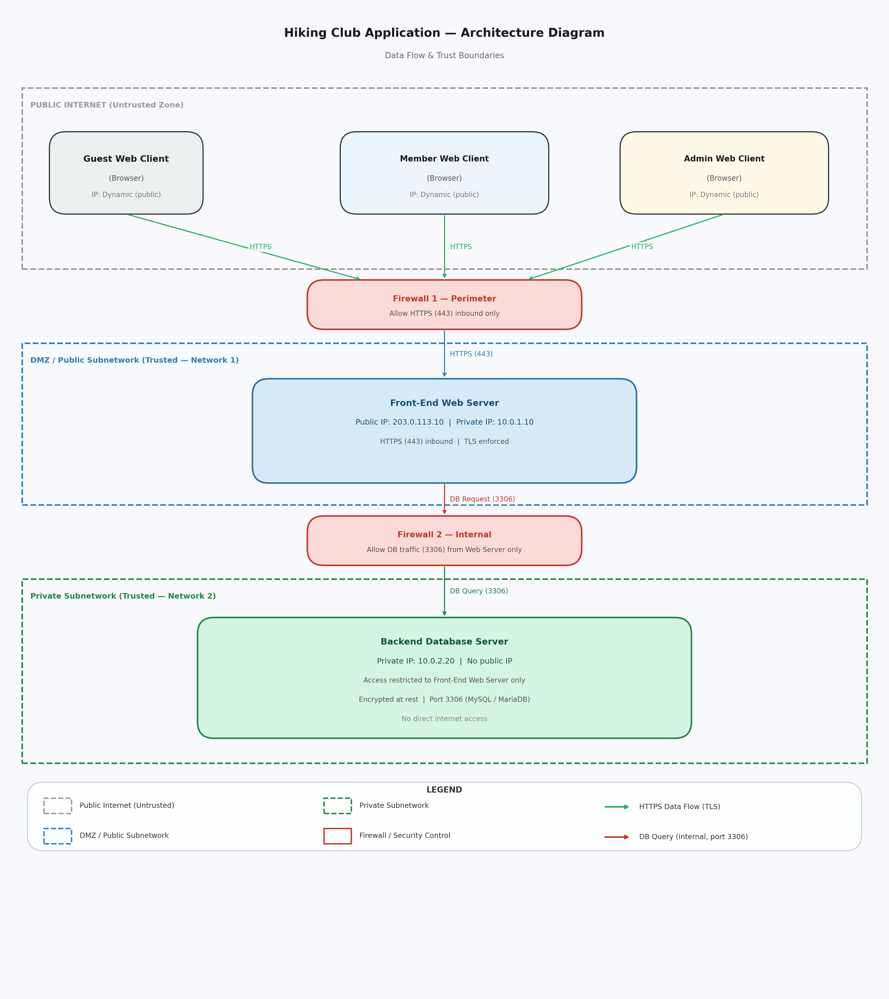

# Hiking Club Application Vulnerability Analysis

## PART 1 - Hiking Club App Design Document

### Description

The Hiking Club application consists of two servers, a front end web server and a backend database server. The front end serves three types of web clients: Admin, Member, and Guest, all having different access restrictions and viewing/editing privileges. There are two types of Admins, the first being a trip leader who can create and manage their trips, and the second being a system admin who can manage user accounts and access financial tools. The Members can view and register for events, as well as edit their personal profile info, while the Guests don't need to log in but are limited to only viewing upcoming events. The backend database is on a server behind a firewall hosted on a private network, only the front end server can communicate with it.

### Organization

The Hiking Club is a member-based nonprofit organization whose primary purpose is to organize and coordinate outdoor hiking trips for its members. The club consists of regular members, trip leaders, and system administrators. Trip leaders volunteer their time to plan and manage individual hiking events, while a small administrative team handles member account management, financial planning, and platform maintenance. The organization relies on its web application as the central hub for all club activity — from event discovery and registration to member communication and finance management.

### Application Environment

The Hiking Club application will be deployed on a cloud-based infrastructure using a provider such as AWS or Microsoft Azure. The front end web server will be hosted in a public-facing subnetwork accessible to the internet, while the backend database server will reside in a private subnetwork protected by a firewall. This setup gives the organization a simple deployment and easier resource management if the application ever scales.

### Security Considerations

The application has multiple features that require security to ensure data and financial protection. Since this application has users with different access levels, the correct authorization and authentication systems need to be in place so that only users with the correct privileges can access restricted data. Since there will also be a payment portal tied to the application, security measures should be taken to protect transactions and prevent unauthorized withdrawals.

## PART 2 - Diagram & Threat Models

### Architectural Diagram

### STRIDE Threat Model

**Spoofing:** Someone pretending to be someone they're not. In the Hiking Club application, this could mean someone pretending to be another member by logging in using their stolen credentials. Someone could also pretend to be the official website's login page by redirecting users to a fake login page to trick them into giving their credentials. 

**Tampering:** Modifying data unauthorized. This could mean that someone intercepts traffic between the web server and database and changes event data. Or someone could modify URL parameters to edit other member's personal profile information instead of their own.

**Repudiation:** When users lie about actions they make in the application and there's no way to prove that they are lying. For the specific application, this could mean a trip leader drops a member from an event but claims they never did, and there is no log that records add/drop history to prove what actually happened. Not having an event log with action history could also mean that members could register for events but say they never did to avoid penalties for a no-show.

**Information Disclosure:** Sensitive data being exposed to users that shouldn't see it. This means a member seeing private medical records for another member. This could also mean unsecure payment information being intercepted by hackers to steal card numbers or transaction details.

**Denial of Service:** When the system in some way or another is overwhelmed by attackers and becomes unavailable. This could mean attackers flood the web server with API requests so members are unable to view/register for events. Another possibility is someone repeatedly trying to guess login information and therefore locks out a legitimate user.

**Elevation of Privilege:** When a user has gained access beyond what their role should allow. In the instance of this application, it could mean a normal member manipulates an API request to gain trip leader privileges and adjust events. Or a logged out guest manipulates the URL to gain access to member only pages.

### OWASP Threat Model

**Assessment Scope**
- Member personal data
- Payment data
- Event and registration data
- Admin credentials
- Database server

**Vulnerabilities**
- Weak or stolen passwords
- Broken access control
- SQL injection
- No audit logs
- Intercepting unencrypted data

**Countermeasures**
- Enforce strong password requirements and multi-factor auth
- Implement role-based access control
- Use parameterized queries to prevent SQL injection
- Keep audit logs
- Use HTTPS on all connections

**Prioritized Risks**
1. Broken access control
2. Compromised credentials
3. Intercepting unencrypted data
4. SQL injection
5. No audit logs