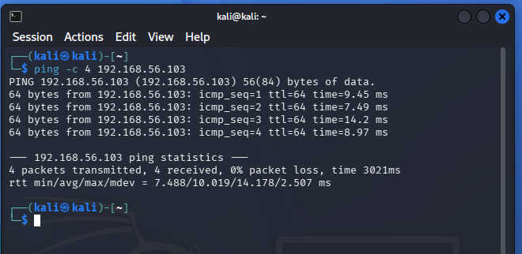
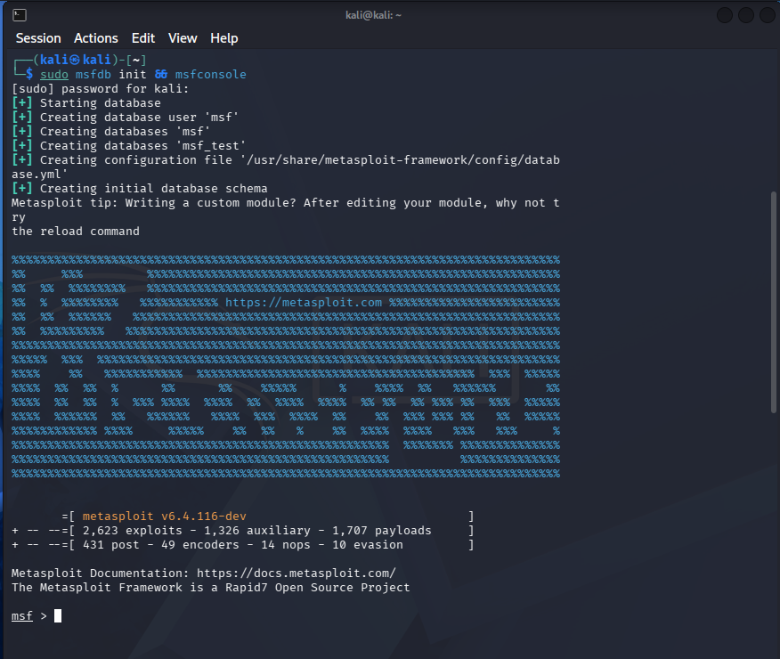
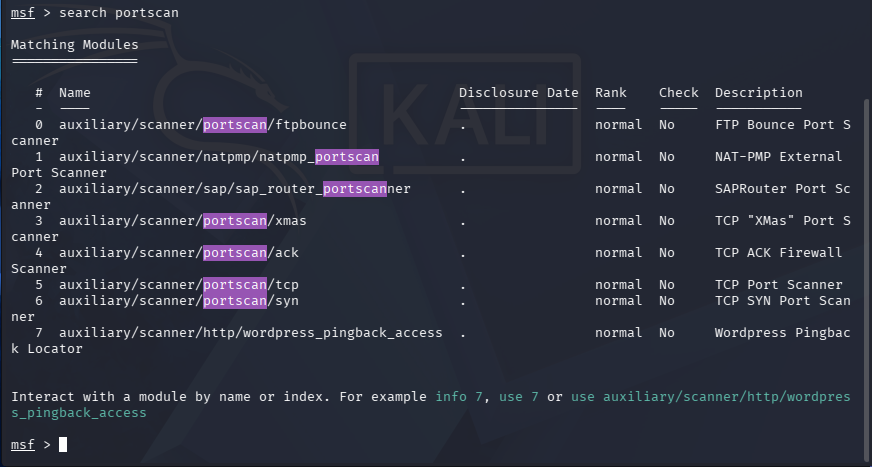
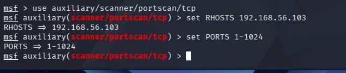
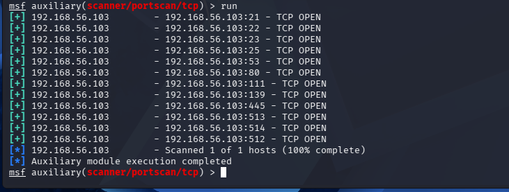

# Project 3 - Penetration Testing Lab 1

## Part 1 - Getting the Lab Running

Both VMs running and connected:

Metasploit running:

## Part 2 - Port Scan of Metasploitable 2

Search for port scanners:

Setting up scanner:

Port scan results:

## Part 3 - Nessus Research

### Introduction

Nessus is a vulnerability scanning tool developed by Tenable, Inc and was originally written in 1998 by Renaud Deraison. Nessus has since become one of the most widely used vulnerability assessment tools in the cybersecurity industry (Singh, 2019, ch. 7, "Working with Vulnerability Scanners"). Rather than requiring a tester to manually probe each service running on a target system, Nessus automates this process by scanning a target, fingerprinting the software and services it finds, and cross-referencing them against a continuously updated database of known vulnerabilities (CVEs). It can be downloaded from [https://www.tenable.com/products/nessus](https://www.tenable.com/products/nessus).

### Big Picture

Nessus fits into the vulnerability analysis phase of the penetration testing process. It analyzes open services for known weaknesses and assigns each weakness found a severity rating (critical, high, medium, low, informational). This can help prioritize which weaknesses to exploit in the next step of the process.

### Lab

Nessus was not part of the default installation of Kali, I followed the steps in Singh's book to install it on my virtual machine. Although I installed it, I have not yet used it in my lab. I hope to use it for project 4, because it seems like a very useful tool in analyzing vulnerabilities.

### Conclusion

Nessus is a very useful tool in automating the process of finding known vulnerabilities and prioritizing them for exploitation. I would recommend taking the extra step to register for the free license and install it on your virtual machine because it's widely used and constantly updated, and seems like the cyber security industry standard for analyzing vulnerabilities.

### References

Singh, G. D. (2019). Learn Kali Linux 2019. Packt Publishing.