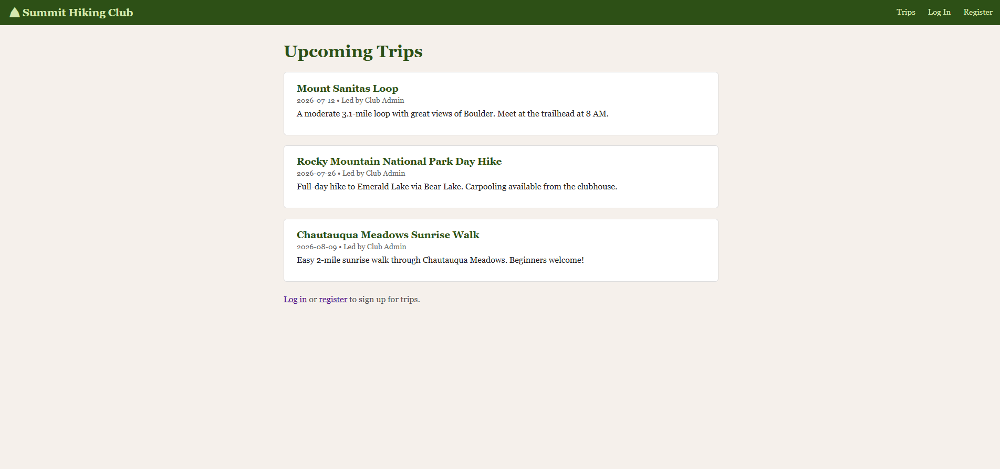
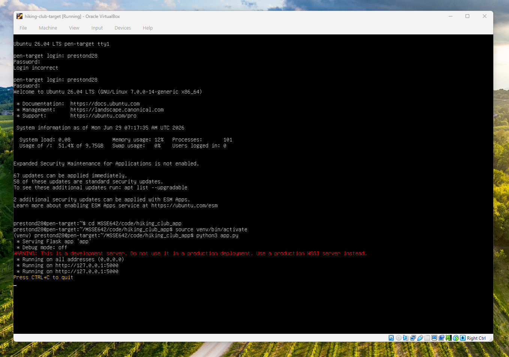
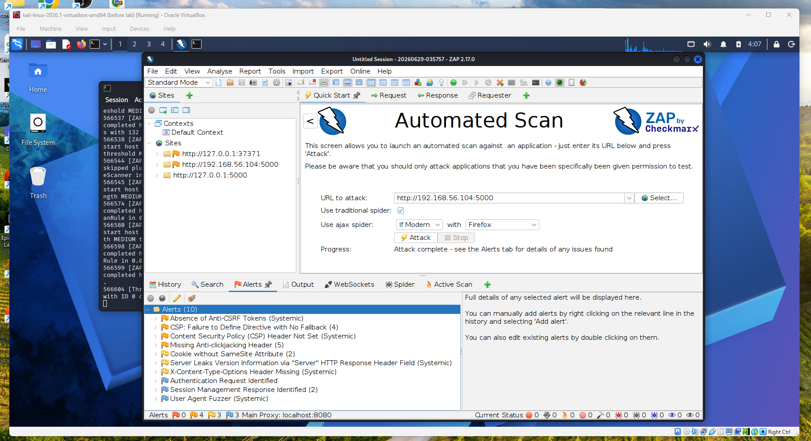
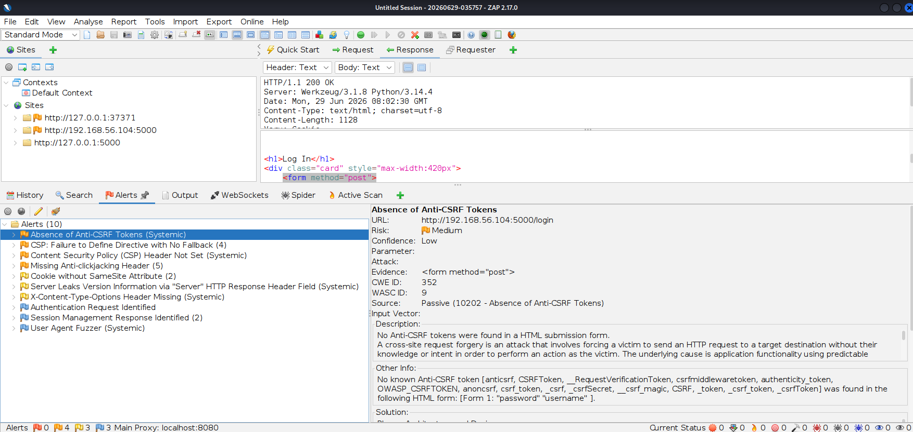
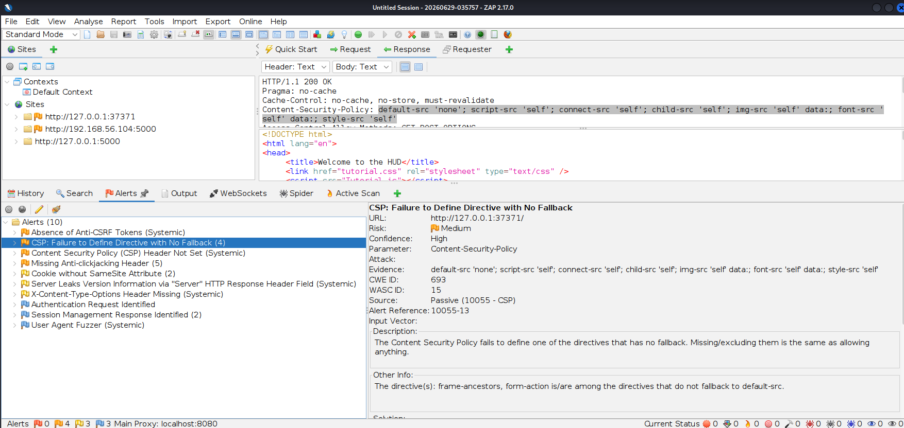
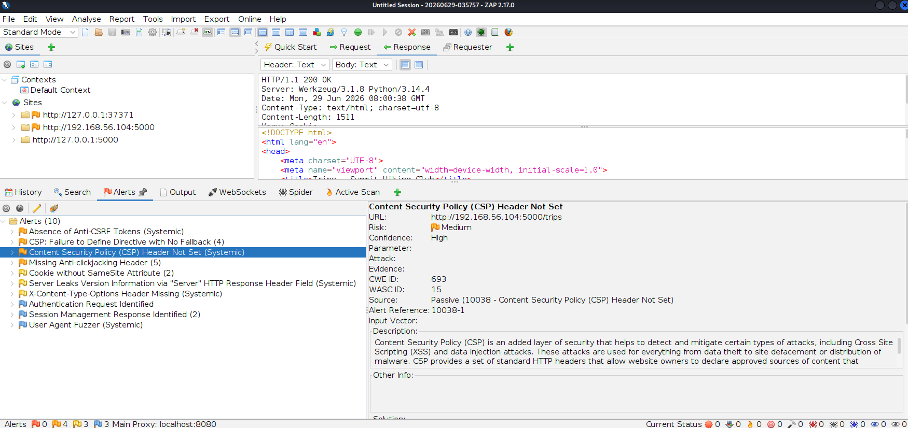
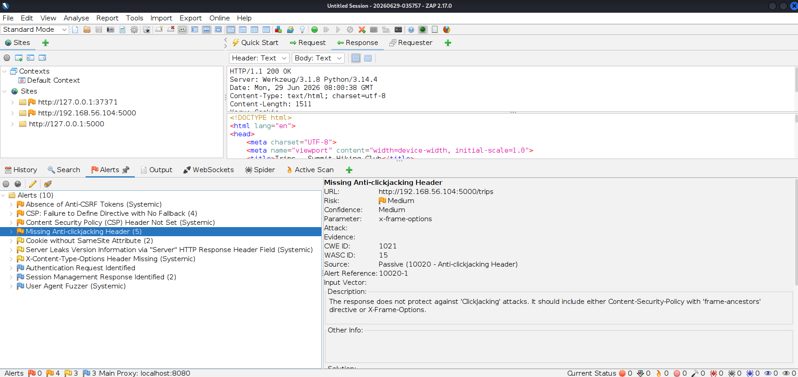

# Project 4 - Penetration Testing Lab 2

# Part 1 - Penetration Testing Procedure
 
## Summary Table
 
| PHASE | DESCRIPTION | TOOLS |
|---|---|---|
| **1. Reconnaissance (Information Gathering)** | This phase is entirely passive — gathering publicly available information about the target organization without ever touching their infrastructure directly. The tester maps out domains, subdomains, employee names/emails, social media presence, and other OSINT to understand who the organization is and what its digital footprint looks like before any active probing begins. This groundwork shapes everything that follows, since it often reveals usernames, technologies, or third-party services worth investigating later. | Maltego |
| **2. Scanning (and Enumeration)** | This phase shifts from passive observation to active probing of the live target, identifying open ports, running services, software versions, and specific misconfigurations on the web server itself. The tester now directly interacts with the target to enumerate exactly what's exposed — outdated software banners, missing security headers, accessible directories — building a concrete list of weaknesses to investigate. This is the bridge between "what does this organization look like" and "what's actually wrong with this specific server." | Nikto |
| **3. Exploitation (Gaining Access)** | This phase turns identified weaknesses into confirmed, exploited vulnerabilities by actively attacking the application. The tester intercepts and manipulates live traffic between the browser and server to test authentication, session handling, and access control — attempting to log in as another user, escalate privileges, or bypass restrictions that should prevent unauthorized access. Success in this phase means the tester has actually gained some level of unauthorized access to the application or its data. | Burp Suite (Community Edition) |
| **4. Maintaining Access** | Once initial access is gained, this phase establishes a way to return to that access without repeating the original exploit. The tester plants a lightweight backdoor on the compromised system, allowing remote command execution on demand to simulate how a real attacker would persist inside the environment after the initial breach. This phase tests whether the organization's monitoring would catch ongoing unauthorized presence, not just the initial break-in. | Weevely |
| **5. Covering Tracks** | This final phase simulates how an attacker would erase evidence of their activity to avoid detection and complicate incident response. The tester clears or manipulates system/event logs and alters file timestamps so that the timeline of the intrusion becomes harder to reconstruct after the fact. Testing this phase shows the organization whether its logging and monitoring would actually preserve a usable trail of evidence if a real attacker tried to cover their tracks. | Metasploit Framework (clearev / timestomp modules) |

## Tool Description and Analysis
 
### Maltego
 
**Vendor:** https://www.maltego.com
 
**Description:** Maltego is an open source intelligence and forensics application that mines and gathers information and represents it in an easy-to-understand graphical format. It works by dragging "entities" (a domain, email address, person, etc.) onto a graph and running "transforms" — automated queries against public data sources — to reveal hidden relationships between people, organizations, and infrastructure. The free Community Edition includes most of the same functionality as the commercial variant, supporting link analysis on a graph with a limited number of transform results and monthly data credits.
 
**Kali Linux 2019 inclusion:** Maltego comes pre-installed in Kali Linux under the Information Gathering category. No manual package installation is needed, but a free user account must be created at Maltego's community registration page before the tool's transforms can be used.
 
**Application to the Hiking Club:** Before the team even looks at the rebuilt Hiking Club website, they'd use Maltego to see what information about the organization is already out there publicly — things like related websites, email addresses, and other details tied to the club. This gives the team a sense of how easy it would be for an attacker to gather background info on staff or trip leaders before even attempting an attack, which connects back to the people-focused risks already noted in the original threat model.

### Nikto
 
**Vendor:** https://cirt.net/Nikto2
 
**Description:** Nikto does not exploit vulnerabilities — instead, it focuses on identification and enumeration, making it suitable for early-stage scanning and auditing of a web server for dangerous files, outdated software versions, and common misconfigurations. It operates using a signature-based detection model and checks the server against a large, regularly updated database of known issues. It is not a stealth tool — scans are noisy and easily detectable, so it's best suited to authorized testing rather than covert assessments.
 
**Kali Linux 2019 inclusion:** Nikto is a popular open source web vulnerability scanner and is preinstalled in Kali Linux. No manual installation required.
 
**Application to the Hiking Club:** Once the new site is up and running in the lab, Nikto would be the first tool pointed at it — basically giving the server a quick health check. It looks for obvious red flags like outdated software, missing safety settings, or leftover files that shouldn't be publicly visible. Since this is a freshly built site rather than one that's been hardened over time, Nikto is likely to turn up a few easy fixes right away, which helps the team know where to focus their more detailed testing next.
 
### Burp Suite (Community Edition)
 
**Vendor:** https://portswigger.net/burp
 
**Description:** Burp Suite is an integrated platform for performing security testing of web applications, with various tools that work seamlessly together to support the entire testing process from initial mapping and analysis of an application's attack surface through to finding and exploiting security vulnerabilities. Its core component is an intercepting proxy that sits between the browser and the target server, letting the tester view and modify every request in transit. The Community Edition does not include automated scanning, but it is highly effective for manual detection of common web vulnerabilities through tools like Repeater and Intruder, which let testers craft payloads and verify issues such as injection flaws or broken access control.
 
**Kali Linux 2019 inclusion:** Burp Suite is available in free and paid versions, and the free Community Edition comes bundled in with Kali Linux. No manual installation required for the Community Edition used in this lab.
 
**Application to the Hiking Club:** This is where the team does the hands-on testing that really matters — checking whether the website actually enforces its own rules. For example, they'd log in as a regular member, then try tricking the site into letting them view or edit another member's profile, or try sneaking into an admin-only page they shouldn't have access to. This directly tests the kind of "wrong person gets access to the wrong thing" risks that were already flagged as a concern back in the original threat model — turning a "this could happen" concern into a confirmed yes-or-no answer.

### Weevely
 
**Vendor:** https://github.com/epinna/weevely3
 
**Description:** Weevely is a stealth PHP web shell that simulates a telnet-like connection, serving as an essential tool for web application post-exploitation that can be used as a stealth backdoor or as a web shell to manage legitimate web accounts. It has more than 30 modules to assist administrative tasks, maintain access, provide situational awareness, elevate privileges, and spread into the target network. The agent itself is a small PHP file uploaded to the compromised server, and the tester then connects to it from the Weevely client to issue commands disguised as ordinary HTTP requests.
 
**Kali Linux 2019 inclusion:** Weevely comes pre-installed in Kali Linux as part of the penetration testing toolkit. No manual installation required.
 
**Application to the Hiking Club:** If the team finds a way to upload a file to the site that shouldn't be allowed (say, through a trip photo or document upload feature), Weevely shows just how serious that mistake can be. Instead of just proving the upload *could* happen, it lets the team plant a small hidden tool on the server and keep coming back to it later — basically showing that one overlooked upload form can turn into a long-term break-in, not just a one-time slip.

### Metasploit Framework
 
**Vendor:** https://www.metasploit.com
 
**Description:** Metasploit Framework is a widely used exploitation and post-exploitation platform that combines an extensive exploit/payload database with modules for everything from initial access to anti-forensics. For this phase specifically, its clearev module clears Windows event logs on a compromised host, and its timestomp module modifies file MACE (modify/access/create/entry) timestamps so the true sequence of file changes is obscured. Both modules exist specifically to simulate how an attacker would erase or distort evidence after gaining access, rather than to gain access itself.
 
**Kali Linux 2019 inclusion:** Metasploit Framework is preinstalled in Kali Linux by default and requires no manual installation; the clearev and timestomp modules are bundled with the framework itself.
 
**Application to the Hiking Club:** After showing they can get back into the site whenever they want, the team would use this step to test something just as important: would anyone notice? These tools let the team try clearing or messing with the records of what happened, to see whether the club's systems would actually catch and preserve evidence of a break-in. If the tampering goes unnoticed, that's a real problem to flag — it means even after an attack is discovered, there might not be enough information left to figure out what actually happened.

# Part 2 - Vibe Coding the Hiking Club Application

I used claude code to vibe code the hiking club application. It's basically just a simpler version of the app described in project 2:

- Guest view: trip listing page (public, no login)
- Auth: register/login/logout (Member + Admin roles)
- Member view: see trip list, register for a trip, edit own profile
- Trip Leader admin view: create/edit/delete their own events, view registrants
- System Admin view: create/disable user accounts
- A backend DB

The code stack is Python/Flask with a SQLite database.

Since Claude already helped me with the previous assignments and knew my chat history and how I wanted to operate things, I told it to make a markdown file for Claude Code to follow while building the app. I had AI tell AI what to do! Pretty crazy if you think about it...

Here's what the app ended up looking like:

Find the code (and README) here: [Vibe-coded hiking app](../../code/hiking_club_app/)

# Part 3 - App deployment on a virtual machine

Getting the app running on a new virtual machine was harder than expected. First I had to set up a new VM with virtual box that had Ubuntu, then I had to install python and the necessary libraries onto the VM. I also had to upload the vibe-coded app to my remote repo, and then clone the repo onto the VM so that it could access the code and run the application. I had a lot of trouble getting everything installed, mostly because I had to keep switching between network adapters for fear of exposing something I shouldn't! I realized by the end of it all I should've just stayed connected to the internet the whole time until I confirmed my app was running, and then switch to a host-only network before I start the pen testing.

Here is the app running on the VM:

# Part 4 - Penetration testing the hiking club application

I was able to successfully install and run OWASP ZAP on my Kali VM. Here are the results of the automated scan I ran, attacking the other VM that was running the hiking club application:

As you can see, there are 10 alerts from this scan. 4 medium priority, 3 low priority, and 4 informational priority alerts. I'm actually shocked and very impressed that there are no high priority alerts!

Here are more details on all 4 medium priority alerts:

### Medium priority alert 1

### Medium priority alert 2

### Medium priority alert 3

### Medium priority alert 4

